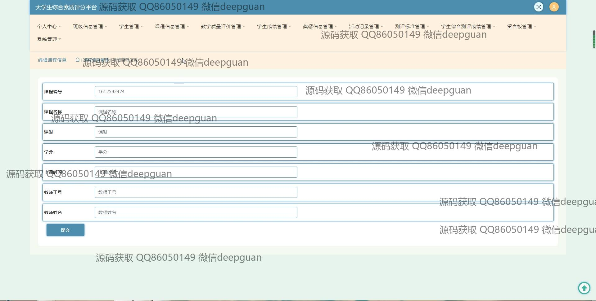
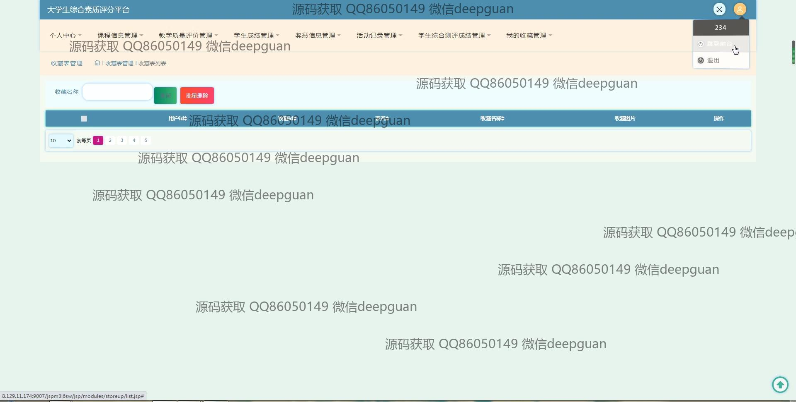
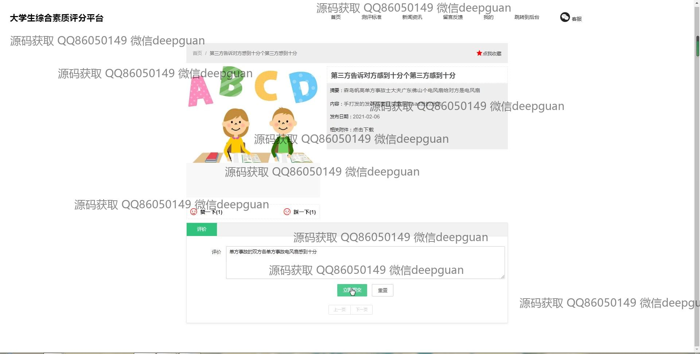
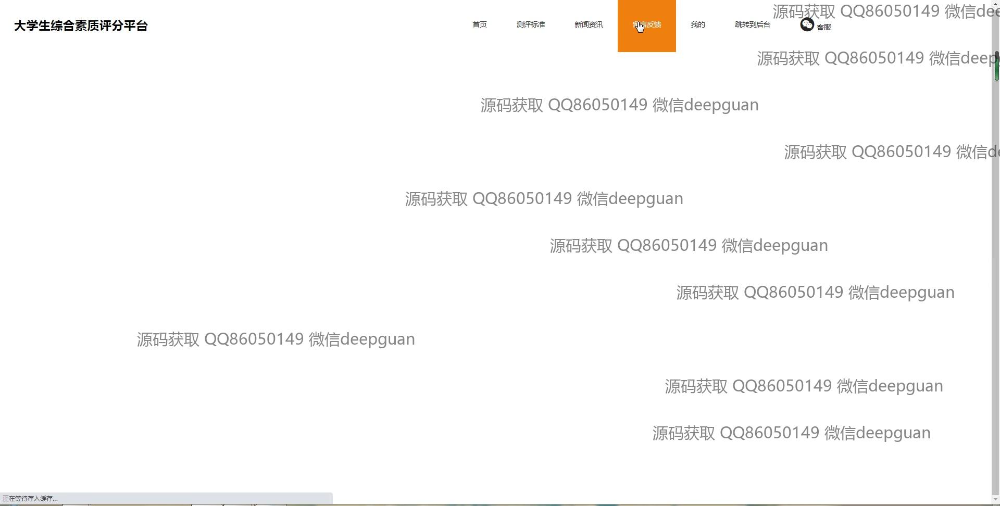

<h1 align="center">的大学生综合素质评分平台vue</h1>

## 简介
大学生综合素质评分平台：角色分为管理员、用户；支持班级管理、学生信息管理、课程管理、奖惩信息管理、综合评估与活动记录等功能。    --计算机毕业设计源码；毕设源码；java毕业设计源码

## 联系方式

<h3 align="center">获取完整代码与数据库文件 + 微信：deepguan QQ: 86050149 QQ群: 783742310</h3>

<h3 align="center">可帮忙远程部署 包运行成功！提供远程部署、修改代码、设计文档指导、代码讲解等服务！</h3>

## 功能介绍（完整见运行截图）
管理员：登录、注册、退出，管理界面模块包括个人中心、班级信息管理、学生管理、课程管理、教学质量评价管理、奖惩信息管理、活动记录管理，支持添加、修改、删除、查看及批量操作，公告的编辑与发布，综合素质评分统计与展示，用户权限管理。

教师：登录、注册、退出，课程信息管理，包括课程列表展示、课程详情查看、课程评价，教学质量评价管理，奖惩信息维护与更新，学生成绩管理，活动记录管理，个人信息查看与更新。

学生：登录、注册、退出，个人界面模块包括查看个人首页、测评标准、新闻资讯，查看与更新个人信息，课程评价，奖惩信息查看，参与活动记录管理，综合素质评分查看，个人信息安全退出。

访客：无需注册即可浏览部分公开信息，查看新闻资讯和评分标准。

## 运行截图

本代码来源于网络,仅供学习参考使用!

